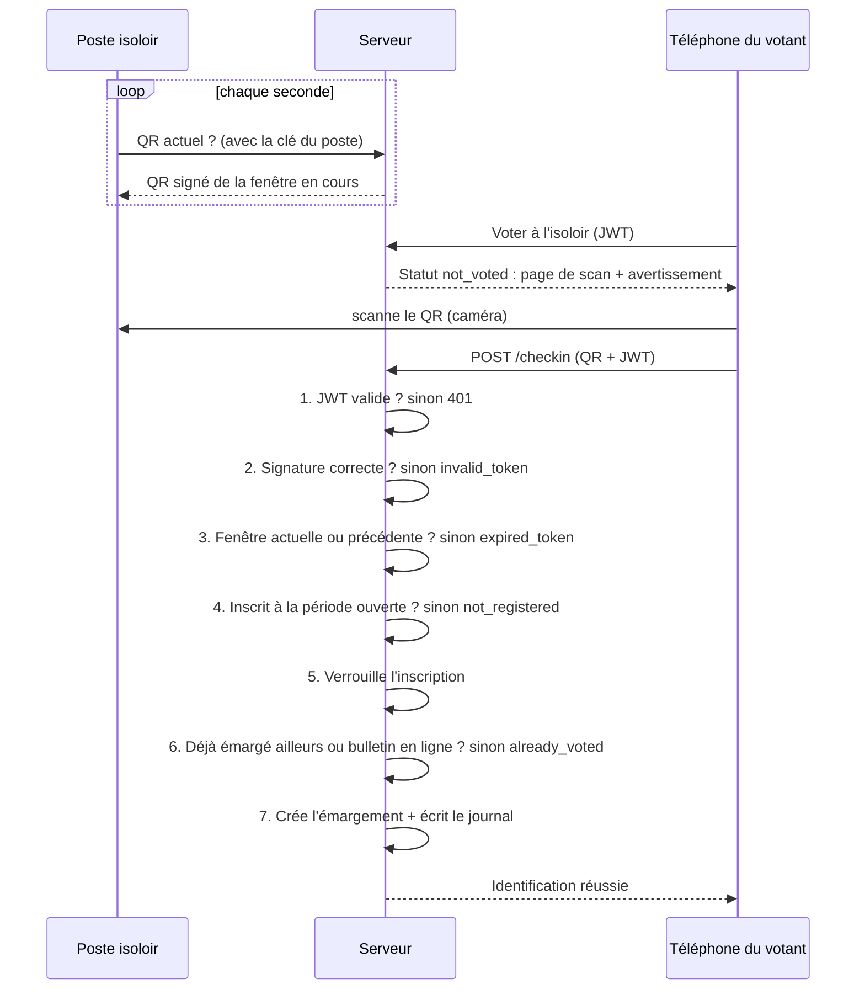

# Sécurité du vote : check-in QR isoloir

Ce que protège le système, comment il le fait, et les failles qui restent. Tout est vérifiable dans le code :
`back/src/main/java/fr/election/api/checkin/`, `front/src/pages/vote/` et `front/src/pages/isoloir/`.

**Sommaire** : [L'enjeu](#1-lenjeu) · [Les deux modes](#2-les-deux-modes) · [Les attaquants](#3-les-attaquants) ·
[Anatomie d'un QR](#4-anatomie-dun-qr) · [Les 6 protections](#5-les-6-protections) · [Parcours d'un scan](#6-parcours-dun-scan) ·
[Attaque par attaque](#7-attaque-par-attaque) · [Failles restantes](#8-failles-restantes) · [Avant le jour J](#9-avant-le-jour-j) · [Quiz](#10-quiz)

---

## 1. L'enjeu

Chaque électeur a **un seul droit de vote**, qu'il peut utiliser **en ligne** (les duels) *ou* **à l'isoloir** (bulletin papier).
Le système répond à une question : *cette personne a-t-elle déjà utilisé son droit, et par quel moyen ?*

Le check-in isoloir est une **feuille d'émargement numérique**. Il ne touche jamais au **contenu** du bulletin papier :
on sait qui s'est présenté à quel isoloir, jamais pour qui il a voté.

« Truquer » peut donc vouloir dire deux choses :
- **Voter deux fois** : une fois en ligne, une fois sur papier.
- **Empêcher quelqu'un de voter** : utiliser son droit à sa place pour qu'il ne puisse plus voter.

## 2. Les deux modes

Dans l'onglet **Voter**, l'électeur choisit son mode (`/vote`). Chaque mode a sa page de confirmation, avec un avertissement en haut.
C'est au moment de la confirmation que le serveur enregistre le choix et ferme l'autre mode.

| | Voter en ligne | Voter à l'isoloir |
|---|---|---|
| Parcours | `/vote/en-ligne` → avertissement → **Commencer** → duels | `/vote/isoloir` → avertissement → **scan du QR** → bulletin papier |
| Ce que fait le serveur | Crée le **bulletin en ligne** (encore vide) dès le clic | Crée l'**émargement** au scan |
| Ce qui est alors bloqué | Le scan à l'isoloir, même si les duels ne sont pas finis | « Commencer » et chaque vote en ligne, même sans bulletin papier |

> Le front masque les boutons qui ne servent plus, mais c'est du confort : **c'est le serveur qui refuse**.
> Quelqu'un qui appelle l'API à la main se heurte aux mêmes refus.

## 3. Les attaquants

En sécurité, on commence toujours par se demander *qui* pourrait attaquer et avec quels moyens : c'est le **modèle de menace**.

| Qui | Ce qu'il a | Ce qu'il veut |
|---|---|---|
| Le votant tricheur | Son téléphone, son compte, un peu de culture technique (Postman, outils du navigateur) | Voter en ligne *et* sur papier |
| Le petit malin du Wi-Fi | Un PC sur le même réseau, des outils pour envoyer des requêtes à la main | Voter à la place d'autres personnes, casser le système « pour voir » |
| La personne dans l'isoloir | Un accès physique au poste isoloir pendant une minute | Lire les secrets du poste, prendre le QR en photo |
| Quelqu'un avec l'accès à la base | Le mot de passe Neon | Tout. On ne peut pas s'en protéger avec du code (voir [failles](#8-failles-restantes)) |

## 4. Anatomie d'un QR

Le QR n'est qu'un texte. Voici un vrai QR généré pendant les tests :

```
CHK1 . 1 . 358034432 . 1790172170000 . 5Tavduw4dldadgwzJEM61bR_r1NurnIYneXkcayrneA
 │     │       │              │                        │
 │     │       │              │                        └─ Signature : la seule partie qui prouve que le QR vient de nous
 │     │       │              └─ Expiration : indicative, le serveur l'ignore
 │     │       └─ Fenêtre de 5 s : l'heure du serveur divisée par 5 000 ms
 │     └─ Numéro d'isoloir
 └─ Version du format
```

Tout le monde peut lire ce texte, et ce n'est pas grave : il n'y a **rien de secret dedans**.
Ce qui compte, c'est que **personne ne peut en fabriquer un valide** sans la clé secrète du serveur.

## 5. Les 6 protections

### 5.1 Identité par JWT
*Une carte d'électeur tamponnée par la mairie, pas un nom écrit sur un papier.*

À la connexion, le serveur remet au téléphone un **jeton signé** (JWT) qui contient l'identifiant de l'électeur.
À chaque appel, le serveur vérifie la signature du jeton et lit l'identité **dedans**, jamais ailleurs.

Pour se faire passer pour Alice, il faudrait fabriquer un jeton au nom d'Alice : impossible sans la clé `JWT_SECRET` du serveur.
C'est le même principe que la signature des QR. Dans le prototype, l'identité passait par un simple en-tête `X-User-Id`,
que n'importe qui pouvait modifier. Cet en-tête est maintenant ignoré, et un test le vérifie.

> Code : `CheckinController` (`@AuthenticationPrincipal Jwt`), `ElectionController`. Test : `checkinExigeUnJwt`.

### 5.2 Signature HMAC
*Un tampon de mairie dont l'encre est secrète.*

Chaque isoloir a une **clé secrète** de 256 bits (`cle_hmac`) qui ne sort jamais du serveur.
Pour signer, le serveur mélange `1:358034432` (isoloir + fenêtre) avec cette clé grâce à l'algorithme **HMAC-SHA256**.
Le résultat est une empreinte unique.

Au scan, le serveur refait le calcul et compare. Si on change un seul chiffre du QR (autre isoloir, autre heure),
l'empreinte ne correspond plus et le QR est refusé. Sans la clé, fabriquer une empreinte valide demande en moyenne
2<sup>255</sup> essais : même avec tous les ordinateurs du monde, c'est impossible.

> Code : `QrTokenService.signer()` et `verifier()`. La comparaison utilise `MessageDigest.isEqual`, qui prend toujours
> le même temps et ne laisse donc rien deviner en chronométrant les réponses.

### 5.3 Rotation toutes les 5 s
*Un ticket de caisse valable 10 secondes.*

La signature couvre aussi la fenêtre de temps. Un QR n'est accepté que pendant sa fenêtre et la suivante,
et **seule l'horloge du serveur compte**. Une photo prise la veille, ou même une minute avant, ne sert à rien.

| 10:00:00 → 10:00:05 (fenêtre du QR) | 10:00:05 → 10:00:10 (fenêtre suivante) | 10:00:10 → … (trop tard) |
|---|---|---|
| scan à 10:00:04 : ✅ accepté | scan à 10:00:08 : ✅ accepté | scan à 10:00:11 : ⏱️ expiré |

Pourquoi accepter la fenêtre suivante ? Pour qu'un votant qui scanne pile au moment où le QR change ne soit pas refusé.

### 5.4 Clé du poste isoloir
*Seul le guichet a le droit de sortir des tickets.*

Si n'importe qui pouvait demander « donne-moi le QR actuel de l'isoloir 1 », il pourrait émarger depuis chez lui sans
jamais entrer dans l'isoloir. L'API ne donne donc le QR qu'au poste qui présente la bonne **clé du poste**
(en-tête `X-Isoloir-Cle`). Sans elle, la réponse est `401`. C'est la seule route du check-in accessible sans JWT.

Le serveur ne stocke pas cette clé, seulement son **empreinte SHA-256** (`cle_tablette_hash`), comme on le fait pour un
mot de passe. Même quelqu'un qui lit la base ne peut pas s'en servir.

> Code : `IsoloirService.qrCourant()` et `SecurityConfig`. Le poste ne génère jamais le QR lui-même :
> il n'affiche que ce que le serveur lui envoie.

### 5.5 Un seul mode, sous verrou
*Un seul stylo pour la feuille d'émargement, et deux colonnes : « en ligne » ou « isoloir ».*

Imagine un scan et un clic sur « Commencer » qui arrivent **à la même milliseconde**. Sans précaution, chacun lirait
« rien n'est encore choisi » et les deux passeraient. C'est ce qu'on appelle une **situation de concurrence** (*race condition*).

Les **trois** actions qui utilisent le droit de vote prennent le **même verrou** sur l'inscription de l'électeur
(`SELECT … FOR UPDATE`). Elles passent donc une par une, et chacune vérifie l'autre mode :
- **le scan** (`CheckinService.checkin`) : refusé si un bulletin en ligne existe ;
- **« Commencer »** (`commencerVoteEnLigne`) : refusé si un émargement existe ;
- **chaque vote de duel** (`ElectionService.voter`) : refusé (409) si un émargement existe.

En plus, une **contrainte unique** sur `emargement_isoloir.id_inscription` et sur `bulletin.id_inscription` sert de
filet de sécurité dans la base.

> Tests : `scansSimultanesUnSeulEmargement`, `clicEnLigneEtScanSimultanesUnSeulGagne` et
> `voteEnLigneEtScanSimultanesJamaisLesDeux` : 10 actions en parallèle, jamais les deux modes.

### 5.6 HTTPS
*Une enveloppe scellée plutôt qu'une carte postale.*

Tout ce qui passe sur le Wi-Fi doit être chiffré : quelqu'un qui écoute le réseau voit alors des données illisibles,
y compris les JWT. C'est aussi une obligation technique : sans HTTPS, les navigateurs mobiles refusent la caméra, et donc le scan.

> Aujourd'hui, seul le serveur de dev (`npm run dev:https`) est en HTTPS, avec un certificat auto-signé.
> La production n'est pas encore prête : voir [failles](#8-failles-restantes).

## 6. Parcours d'un scan

Chaque vérification peut arrêter le scan. Le votant n'est émargé que si toutes passent.



Le poste isoloir n'apprend jamais qui a scanné : seul le téléphone du votant reçoit la réponse.
Chaque scan, réussi ou refusé, est tracé dans `journal_checkin` (audit uniquement).

## 7. Attaque par attaque

| L'attaque | Ce qui se passe | Statut |
|---|---|---|
| Se faire passer pour un autre votant | L'identité vient du JWT signé ; `X-User-Id` est ignoré. | ✅ Protégé |
| Fabriquer un faux QR | Sans la clé secrète, la signature est fausse : `invalid_token`. | ✅ Protégé |
| Modifier un vrai QR (autre isoloir, autre heure) | La signature ne correspond plus : `invalid_token`. | ✅ Protégé |
| Réutiliser une photo du QR prise plus tôt | Au-delà de 5 à 10 s : `expired_token`. | ✅ Protégé |
| Récupérer le QR via l'API depuis chez soi | Pas de clé du poste : `401`. | ✅ Protégé |
| Commencer en ligne, puis scanner à l'isoloir | Bulletin en ligne existant : `already_voted`. | ✅ Protégé |
| Scanner, puis voter en ligne via l'API | `voter()` refuse en 409, même sans passer par « Commencer ». | ✅ Protégé |
| Scan et vote en ligne à la même milliseconde | Même verrou : un seul des deux passe. | ✅ Protégé |
| Scanner dans deux isoloirs | Un seul émargement : le deuxième est refusé. | ✅ Protégé |
| Envoyer une photo du QR en direct à un complice | Il peut scanner dans les ~7 s. Limite acceptée par la spec. | ⚪ Accepté |
| Écouter le Wi-Fi | Chiffré en dev ; en prod, HTTPS pas encore en place. | 🟠 Partiel |
| Lire la clé sur le poste isoloir | Possible avec un clavier et F12 : dépend de l'installation. | 🟠 Installation |
| Deviner le mot de passe d'un étudiant | Aucune limite d'essais sur la connexion. | 🔴 Ouvert |
| Voter en ligne, puis voter sur papier *sans* scanner | Rien dans le code ne peut l'empêcher : l'urne est physique. | 🔴 Ouvert |

## 8. Failles restantes

De la plus grave à la moins grave.

### 🔴 Critique (organisation) : le QR ne peut pas empêcher de voter sur papier sans scanner
Le système verrouille l'appli, mais **rien n'oblige à scanner avant de glisser un bulletin dans l'urne**. Un votant qui
a voté en ligne peut entrer dans l'isoloir, ignorer l'écran, voter sur papier et repartir. Aucun code ne peut l'empêcher.

**Correction, à décider en équipe** : au dépôt du bulletin, un assesseur vérifie sur le téléphone l'écran
« Identification réussie », rechargé devant lui pour éviter une capture d'écran. Autre option : garder une feuille
d'émargement papier à l'urne en plus du QR.

### 🔴 Critique : pas de limite d'essais à la connexion
Rien n'empêche d'essayer des milliers de mots de passe sur `/api/auth/login`. Deviner le mot de passe d'un étudiant
permet de **voter à sa place** : le JWT sera alors authentique, et toutes les protections ci-dessus le laisseront passer.

**Correction** : bloquer un compte (ou une adresse IP) quelques minutes après 5 échecs, et imposer des mots de passe solides.

### 🟠 Important (déploiement) : la production n'est pas encore sécurisée
- `front/nginx.conf` sert le front en **HTTP** et ne relaie pas `/api` : la caméra sera bloquée et le front ne joindra pas l'API.
- `docker-compose.yml` ouvre la base (`5432`) et le back (`8080`) à tout le réseau, avec le mot de passe `change_me`
  écrit dans le dépôt, et ne fournit pas `JWT_SECRET`.
- Le certificat de dev est auto-signé : il habitue les gens à cliquer « Continuer », ce qu'un attaquant peut exploiter
  avec son propre faux certificat.

**Correction** : nginx en HTTPS avec un vrai certificat (Let's Encrypt), proxy `/api` vers le back, CORS réglé sur la
vraie adresse ; dans docker-compose, n'exposer que le front et passer les secrets par un `.env`.

### 🟠 Important (déploiement) : les clés de démo sont publiques
Les clés de test (`cle-test-isoloir`, `tablette-isoloir-1-demo`) et le compte `root@demo.fr` / `root` du profil `demo`
sont sur GitHub.

**Correction** : ne jamais les utiliser en prod. Une clé aléatoire par isoloir (`openssl rand -hex 24`), et **jamais**
le profil `demo` sur la base de prod. Voir le [README à la racine](../README.md).

### 🟠 À discuter : le vote en ligne n'est pas secret dans la base
Chaque choix de duel (`ligne_vote`) remonte à l'électeur par `bulletin → inscription → utilisateur`. Quiconque lit la
base sait qui a voté quoi. C'est l'inverse de l'isoloir papier, où le lien n'existe pas.

**Piste** : enregistrer « a voté » séparément et stocker les bulletins sans lien avec l'identité. C'est un gros
changement de conception, qui obligerait à voter tous les duels en une seule fois.

### 🟠 À aligner : la borne ESP32 et l'isoloir papier
La borne de Léo (`borne/`) est un isoloir *électronique* : on scanne un QR, puis on vote avec des boutons. Ses routes ne
sont pas encore dans le back. Si elle coexiste avec l'isoloir papier, elle devra passer par **le même verrou** et les
mêmes vérifications, sinon on retrouve un double vote possible.

### ⚪ Accepté : relais en temps réel
Dans l'isoloir, quelqu'un filme le QR en direct pour un complice qui scanne dans les ~7 s. La rotation ne peut pas
l'empêcher. Conséquence : le complice perd lui-même son vote en ligne, sans être dans l'isoloir pour voter sur papier.
Le relais ne rapporte donc pas de voix en plus. La spec l'accepte (§5).

### ⚪ Faible : pas de limite de requêtes sur le check-in
Rien n'empêche d'envoyer des milliers de scans par seconde. Ça ne permet pas de deviner un QR, mais ça peut remplir
`journal_checkin` ou ralentir le serveur.

### ⚪ Hors code : le serveur et la base sont la racine de confiance
Toutes les protections supposent que le serveur n'est pas compromis. Quelqu'un qui a le mot de passe Neon ou le
`JWT_SECRET` peut tout contourner. Garde le `.env` secret, limite l'accès à Neon à 1 ou 2 personnes, et ne partage
jamais ces valeurs dans un message ou sur GitHub.

### ✅ Corrigé
- ~~N'importe qui pouvait se faire passer pour un autre votant~~ : l'en-tête `X-User-Id` du prototype est remplacé par le JWT.
- ~~Voter en ligne après s'être identifié à l'isoloir~~ : `ElectionService.voter()` prend le verrou et refuse en 409 ;
  « Commencer » bloque aussi l'isoloir dans l'autre sens.

## 9. Avant le jour J

- [x] Le JWT remplace `X-User-Id`.
- [x] Le vote en ligne est refusé après un check-in, et inversement.
- [x] Tables du check-in créées sur la base de prod.
- [ ] L'équipe a décidé comment l'urne vérifie le check-in (assesseur ou émargement papier).
- [ ] Limite d'essais à la connexion.
- [ ] nginx en HTTPS avec un vrai certificat, proxy `/api`, CORS réglé.
- [ ] docker-compose : seul le front exposé, secrets dans un `.env`.
- [ ] Vrais isoloirs créés le jour de l'installation, une clé aléatoire par poste ([README à la racine](../README.md)).
- [ ] Postes isoloirs installés selon la [checklist](README.md#installation-dun-poste-isoloir) (pas de clavier, mode kiosque, serveur ailleurs).
- [ ] Décision avec l'équipe de Léo sur la borne ESP32.
- [ ] Accès à Neon limité à 1 ou 2 personnes ; profil `demo` jamais lancé sur la prod.

## 10. Quiz

<details>
<summary>Le texte du QR est lisible par tout le monde. Est-ce un problème ?</summary>

Non. Il n'y a rien de secret dedans. La sécurité vient de la signature : tout le monde peut la lire, mais seul le
serveur, qui a la clé, peut en produire une valide.
</details>

<details>
<summary>Pourquoi le serveur ignore-t-il l'identité que le téléphone pourrait envoyer ?</summary>

Parce que le téléphone peut mentir : n'importe qui peut modifier une requête. Le serveur ne croit que le JWT, qu'il a
lui-même signé à la connexion. C'est exactement le problème qu'avait `X-User-Id` dans le prototype.
</details>

<details>
<summary>Pourquoi « Commencer » crée-t-il le bulletin avant même le premier duel ?</summary>

Pour que le choix du mode soit définitif dès la confirmation, comme le scan à l'isoloir. Sinon, un électeur pourrait
cliquer « Commencer », ne voter aucun duel, puis aller scanner à l'isoloir.
</details>

<details>
<summary>Le front masque le vote en ligne après un scan. Pourquoi faut-il quand même le bloquer dans <code>voter()</code> ?</summary>

Parce que le front n'est pas une protection : quelqu'un peut appeler `POST /api/vote/…` directement avec son JWT. Seul
le serveur peut refuser. C'était le trou corrigé dans `ElectionService.voter()`.
</details>

<details>
<summary>Quelqu'un prend une photo du QR à 10:00:02 et la scanne chez lui à 10:03. Que se passe-t-il ?</summary>

`expired_token` : la fenêtre du QR est terminée depuis longtemps, et on ne peut pas changer l'heure du QR sans casser la signature.
</details>

<details>
<summary>Pourquoi les trois actions (scan, « Commencer », vote) prennent-elles le même verrou ?</summary>

Pour qu'elles passent l'une après l'autre. Sans verrou, un scan et un vote envoyés à la même milliseconde liraient tous
les deux « rien n'est choisi » et passeraient tous les deux.
</details>

<details>
<summary>Quelle est la faille la plus grave aujourd'hui côté code ?</summary>

L'absence de limite d'essais à la connexion : deviner un mot de passe donne un vrai JWT, et le système ne peut alors plus
distinguer l'attaquant du vrai électeur.
</details>

<details>
<summary>Si la sécurité est si bonne, pourquoi le mot de passe Neon et le <code>JWT_SECRET</code> doivent-ils rester secrets ?</summary>

Parce que toutes les protections reposent sur eux. Avec l'accès à la base, on modifie les tables directement ; avec le
`JWT_SECRET`, on fabrique des jetons au nom de n'importe qui.
</details>

---

*État du code : branche `qr-code`, après la fusion de `main` (commit `b69310c`).*
