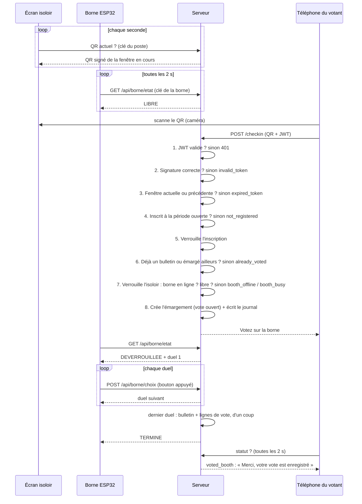

# Sécurité du vote : check-in QR isoloir et borne

Ce que protège le système, comment il le fait, et les failles qui restent. Tout est vérifiable dans le code :
`back/src/main/java/fr/election/api/checkin/`, `front/src/pages/vote/`, `front/src/pages/isoloir/`, et le contrat
de la borne dans [borne/API.md](../borne/API.md).

> ⚠️ **Mise à jour : le QR a été remplacé par un code à 6 chiffres.** L'écran de l'isoloir affiche un code qui change
> toutes les 30 s, que le votant tape dans l'appli (`POST /api/checkin { code }`) : plus besoin de caméra ni de HTTPS.
> Le principe reste le même (HMAC avec la clé de l'isoloir, vérifié par le serveur) : voir
> [la section sur le code](#le-code-à-6-chiffres-remplace-le-qr). Le reste du document décrit encore le QR : partout où
> il dit « QR » ou « scan », lire « code » (`CodeIsoloirService` a remplacé `QrTokenService`).

**Sommaire** : [L'enjeu](#1-lenjeu) · [Les deux modes](#2-les-deux-modes) · [Les attaquants](#3-les-attaquants) ·
[Anatomie d'un QR](#4-anatomie-dun-qr) · [Les 8 protections](#5-les-8-protections) · [Parcours d'un vote à l'isoloir](#6-parcours-dun-vote-à-lisoloir) ·
[Attaque par attaque](#7-attaque-par-attaque) · [Failles restantes](#8-failles-restantes) · [Avant le jour J](#9-avant-le-jour-j) · [Quiz](#10-quiz)

---

## 1. L'enjeu

Chaque électeur a **un seul droit de vote**, qu'il peut utiliser **en ligne** (les duels sur son téléphone) *ou*
**à l'isoloir**, sur la **borne** : une carte ESP32 avec 6 LED et 3 boutons, qui fait jouer les mêmes duels.
Le bulletin papier n'existe plus qu'en **secours**, en cas de panne.

Un isoloir, c'est donc **un écran** qui affiche un QR qui change toutes les 5 s, et **une borne**. Le scan du QR avec
l'appli fait deux choses : il prouve que le votant est **devant l'écran**, et il **ouvre son vote sur la borne**.

« Truquer » peut vouloir dire trois choses :
- **Voter deux fois** : en ligne et sur la borne, ou deux fois sur la borne.
- **Voter à la place de quelqu'un** : utiliser son droit pour qu'il ne puisse plus voter.
- **Fausser le décompte** : faire compter un vote incomplet, ou un choix qui n'a pas été fait.

## 2. Les deux modes

Dans l'onglet **Voter**, l'électeur choisit son mode (`/vote`). Chaque mode a sa page de confirmation, avec un avertissement en haut.
C'est au moment de la confirmation que le serveur enregistre le choix et ferme l'autre mode.

| | Voter en ligne | Voter à l'isoloir |
|---|---|---|
| Parcours | `/vote/en-ligne` → avertissement → **Commencer** → duels sur le téléphone | `/vote/isoloir` → avertissement → **scan du QR** → duels sur la borne |
| Ce que fait le serveur | Crée le **bulletin en ligne** (encore vide) dès le clic | Crée l'**émargement** au scan : le vote est ouvert sur la borne de cet isoloir |
| Quand le vote est fini | Après le dernier duel sur le téléphone | Au dernier duel sur la borne, le serveur écrit le bulletin d'un coup |
| Ce qui est alors bloqué | Le scan à l'isoloir, même si les duels ne sont pas finis | « Commencer » et chaque vote en ligne |

> Le front masque les boutons qui ne servent plus, mais c'est du confort : **c'est le serveur qui refuse**.
> Quelqu'un qui appelle l'API à la main se heurte aux mêmes refus.

## 3. Les attaquants

En sécurité, on commence toujours par se demander *qui* pourrait attaquer et avec quels moyens : c'est le **modèle de menace**.

| Qui | Ce qu'il a | Ce qu'il veut |
|---|---|---|
| Le votant tricheur | Son téléphone, son compte, un peu de culture technique (Postman, outils du navigateur) | Voter deux fois |
| Le petit malin du Wi-Fi | Un PC sur le même réseau, des outils pour envoyer des requêtes à la main | Voter à la place d'autres personnes, se faire passer pour une borne |
| La personne dans l'isoloir | Un accès physique à l'écran et à la borne pendant une minute | Lire les secrets du poste, filmer le QR, bricoler la borne |
| Quelqu'un avec l'accès à la base | Le mot de passe Neon | Tout. On ne peut pas s'en protéger avec du code (voir [failles](#8-failles-restantes)) |

## 4. Anatomie d'un QR

Le QR n'est qu'un texte. Voici un vrai QR généré pendant les tests :

```
CHK1 . 1 . 358034432 . 1790172170000 . 5Tavduw4dldadgwzJEM61bR_r1NurnIYneXkcayrneA
 │     │       │              │                        │
 │     │       │              │                        └─ Signature : la seule partie qui prouve que le QR vient de nous
 │     │       │              └─ Expiration : indicative, le serveur l'ignore
 │     │       └─ Fenêtre de 5 s : l'heure du serveur divisée par 5 000 ms
 │     └─ Numéro d'isoloir
 └─ Version du format
```

Tout le monde peut lire ce texte, et ce n'est pas grave : il n'y a **rien de secret dedans**.
Ce qui compte, c'est que **personne ne peut en fabriquer un valide** sans la clé secrète du serveur.

## 5. Les 8 protections

### 5.1 Identité par JWT
*Une carte d'électeur tamponnée par la mairie, pas un nom écrit sur un papier.*

À la connexion, le serveur remet au téléphone un **jeton signé** (JWT) qui contient l'identifiant de l'électeur.
À chaque appel, le serveur vérifie la signature du jeton et lit l'identité **dedans**, jamais ailleurs.

Pour se faire passer pour Alice, il faudrait fabriquer un jeton au nom d'Alice : impossible sans la clé `JWT_SECRET` du serveur.
C'est le même principe que la signature des QR. Dans le prototype, l'identité passait par un simple en-tête `X-User-Id`,
que n'importe qui pouvait modifier. Cet en-tête est maintenant ignoré, et un test le vérifie.

> Code : `CheckinController` (`@AuthenticationPrincipal Jwt`), `ElectionController`. Test : `checkinExigeUnJwt`.

### 5.2 Signature HMAC
*Un tampon de mairie dont l'encre est secrète.*

Chaque isoloir a une **clé secrète** de 256 bits (`cle_hmac`) qui ne sort jamais du serveur.
Pour signer, le serveur mélange `1:358034432` (isoloir + fenêtre) avec cette clé grâce à l'algorithme **HMAC-SHA256**.
Le résultat est une empreinte unique.

Au scan, le serveur refait le calcul et compare. Si on change un seul chiffre du QR (autre isoloir, autre heure),
l'empreinte ne correspond plus et le QR est refusé. Sans la clé, fabriquer une empreinte valide demande en moyenne
2<sup>255</sup> essais : même avec tous les ordinateurs du monde, c'est impossible.

> Code : `QrTokenService.signer()` et `verifier()`. La comparaison utilise `MessageDigest.isEqual`, qui prend toujours
> le même temps et ne laisse donc rien deviner en chronométrant les réponses.

### 5.3 Rotation toutes les 5 s
*Un ticket de caisse valable 10 secondes.*

La signature couvre aussi la fenêtre de temps. Un QR n'est accepté que pendant sa fenêtre et la suivante,
et **seule l'horloge du serveur compte**. Une photo prise la veille, ou même une minute avant, ne sert à rien.

| 10:00:00 → 10:00:05 (fenêtre du QR) | 10:00:05 → 10:00:10 (fenêtre suivante) | 10:00:10 → … (trop tard) |
|---|---|---|
| scan à 10:00:04 : ✅ accepté | scan à 10:00:08 : ✅ accepté | scan à 10:00:11 : ⏱️ expiré |

Pourquoi accepter la fenêtre suivante ? Pour qu'un votant qui scanne pile au moment où le QR change ne soit pas refusé.

C'est la grosse différence avec le premier projet de borne, qui prévoyait un **autocollant QR fixe** : une photo
suffisait pour déverrouiller la borne depuis n'importe où.

### 5.4 Clé du poste isoloir
*Seul le guichet a le droit de sortir des tickets.*

Si n'importe qui pouvait demander « donne-moi le QR actuel de l'isoloir 1 », il pourrait émarger depuis chez lui sans
jamais entrer dans l'isoloir. L'API ne donne donc le QR qu'au poste qui présente la bonne **clé du poste**
(en-tête `X-Isoloir-Cle`). Sans elle, la réponse est `401`. C'est la seule route du check-in accessible sans JWT.

Le serveur ne stocke pas cette clé, seulement son **empreinte SHA-256** (`cle_tablette_hash`), comme on le fait pour un
mot de passe. Même quelqu'un qui lit la base ne peut pas s'en servir.

> Code : `IsoloirService.qrCourant()` et `SecurityConfig`. Le poste ne génère jamais le QR lui-même :
> il n'affiche que ce que le serveur lui envoie.

### 5.5 Un seul mode, sous verrou
*Un seul stylo pour la feuille d'émargement, et deux colonnes : « en ligne » ou « isoloir ».*

Imagine un scan et un clic sur « Commencer » qui arrivent **à la même milliseconde**. Sans précaution, chacun lirait
« rien n'est encore choisi » et les deux passeraient. C'est ce qu'on appelle une **situation de concurrence** (*race condition*).

Les actions qui utilisent le droit de vote prennent le **même verrou** sur l'inscription de l'électeur
(`SELECT … FOR UPDATE`). Elles passent donc une par une, et chacune vérifie l'autre mode :
- **le scan** (`CheckinService.checkin`) : refusé si un bulletin existe ;
- **« Commencer »** (`commencerVoteEnLigne`) : refusé si un émargement existe ;
- **chaque vote de duel en ligne** (`ElectionService.voter`) : refusé (409) si un émargement existe ;
- **le dernier duel sur la borne** (route de l'autre équipe) : doit prendre ce même verrou avant d'écrire le bulletin
  ([API.md §5](../borne/API.md)).

En plus, une **contrainte unique** sur `emargement_isoloir.id_inscription` et sur `bulletin.id_inscription` sert de
filet de sécurité dans la base.

> Tests : `scansSimultanesUnSeulEmargement`, `clicEnLigneEtScanSimultanesUnSeulGagne` et
> `voteEnLigneEtScanSimultanesJamaisLesDeux` : 10 actions en parallèle, jamais les deux modes.

### 5.6 Une borne, un votant à la fois
*Un seul électeur derrière le rideau.*

Au scan, avant d'ouvrir le vote, le serveur **verrouille la ligne de l'isoloir** puis vérifie que sa borne :
- est **en ligne** : elle a appelé le serveur il y a moins de 10 s, sinon `booth_offline` ;
- est **libre** : aucun autre votant n'y a de vote ouvert (émargé, sans bulletin), sinon `booth_busy`.

Sans ce verrou, deux votants qui scannent le même isoloir en même temps ouvriraient tous les deux un vote sur la même
borne. Dans les deux cas de refus, rien n'est écrit : le votant peut réessayer.

> Code : `CheckinService.checkin`, `IsoloirRepository.findByIdForUpdate`, `EmargementIsoloirRepository.existsVoteOuvert`.
> Tests : `borneHorsLigneRefuse`, `borneOccupeeJusquAuBulletin`, `votantsSimultanesSurLaMemeBorneUnSeulPasse`.
> Limite : sur H2, la base des tests, les scans passent déjà un par un. Le verrou de l'isoloir n'est vraiment mis à
> l'épreuve que sur Postgres (Neon).

### 5.7 La borne obéit, et prouve qui elle est
*Un bulletin ne sort que de la bonne urne.*

La borne ne décide rien : elle **affiche** les deux candidats que le serveur lui donne et **transmet** le bouton appuyé.
Elle ne sait pas qui vote et ne parle jamais au téléphone.

À chaque appel, elle présente **sa clé** (`X-Borne-Cle`). Le serveur en déduit **de quel isoloir il s'agit** : la
borne n'envoie jamais de numéro, elle ne peut donc pas se faire passer pour une autre. Comme pour l'écran, la base ne
garde que l'empreinte SHA-256 (`cle_borne_hash`), et cette clé est **différente** de celle de l'écran : si l'une fuit,
l'autre reste sûre.

Le serveur vérifie aussi que chaque choix porte sur **le duel attendu**, et qu'un choix renvoyé deux fois après une
coupure Wi-Fi **n'est pas compté deux fois**.

> Contrat : [borne/API.md](../borne/API.md) §3 à §5. Ces vérifications sont dans les routes `/api/borne/...`,
> **pas encore écrites** (autre équipe) : à relire quand elles arrivent.

### 5.8 Un vote incomplet ne compte jamais
*On ne compte que les bulletins entièrement remplis.*

- **Sur la borne**, les choix restent **provisoires** jusqu'au dernier duel. Le bulletin et toutes ses lignes sont écrits
  d'un seul coup, dans une transaction. Un vote pas fini ne laisse aucun demi-bulletin.
- **Dans les résultats**, le classement et les statistiques ne lisent que les lignes des **bulletins complets**
  (autant de lignes que de duels). Ça protège aussi le vote en ligne, qui écrit ses lignes duel par duel.

> Code : `LigneVoteRepository.findCompletesByPeriode`. Test : `voteIncompletNeCompteDansLesResultats`.

### Le code à 6 chiffres (remplace le QR)
*Le même tampon, recopié à la main.*

L'écran affiche un **code à 6 chiffres** qui change toutes les 30 s. Le votant le tape dans l'appli
(`POST /api/checkin`), et le serveur fait ensuite les mêmes vérifications qu'avec l'ancien QR. Contrairement au QR,
il ne demande pas la caméra, donc pas de HTTPS : le site peut rester en `http://`.

- Le code est calculé comme un code d'authentification à deux facteurs (TOTP) : HMAC-SHA256 de
  `CODE:{id_isoloir}:{fenêtre de 30 s}` avec la clé de l'isoloir. Sans la clé, impossible de le prévoir.
- Accepté pendant sa fenêtre et la suivante (30 à 60 s). Le votant ne tape que le code : le serveur retrouve l'isoloir.
- **Limite d'essais** : 5 codes faux en 5 min par votant, puis refus (`too_many_attempts`). Un code tapé au hasard a environ 2 × (nombre d'isoloirs) chances sur 1 000 000
  de tomber juste (fenêtre courante et précédente) : hors de portée avec 5 essais.
- **Faiblesse par rapport à l'ancien QR** : un code se dicte au téléphone plus facilement qu'un QR ne se photographie. Quelqu'un
  dans l'isoloir peut donc le lire à un complice dehors, qui a 30 à 60 s pour le taper. Même parade que pour un QR
  filmé : la borne n'ouvre qu'un vote à la fois (`booth_busy`), et l'assesseur voit qui entre dans l'isoloir.

## 6. Parcours d'un vote à l'isoloir

Chaque vérification peut arrêter le scan. Le vote n'est ouvert sur la borne que si toutes passent.



L'écran de l'isoloir n'apprend jamais qui a scanné, et la borne non plus : elle ne reçoit qu'un numéro de vote.
Chaque scan, réussi ou refusé, est tracé dans `journal_checkin` (audit uniquement).

## 7. Attaque par attaque

| L'attaque | Ce qui se passe | Statut |
|---|---|---|
| Se faire passer pour un autre votant | L'identité vient du JWT signé ; `X-User-Id` est ignoré. | ✅ Protégé |
| Fabriquer un faux QR | Sans la clé secrète, la signature est fausse : `invalid_token`. | ✅ Protégé |
| Modifier un vrai QR (autre isoloir, autre heure) | La signature ne correspond plus : `invalid_token`. | ✅ Protégé |
| Réutiliser une photo du QR prise plus tôt | Au-delà de 5 à 10 s : `expired_token`. | ✅ Protégé |
| Récupérer le QR via l'API depuis chez soi | Pas de clé du poste : `401`. | ✅ Protégé |
| Commencer en ligne, puis scanner à l'isoloir | Bulletin existant : `already_voted`. | ✅ Protégé |
| Scanner, puis voter en ligne via l'API | `voter()` refuse en 409, même sans passer par « Commencer ». | ✅ Protégé |
| Scan et vote en ligne à la même milliseconde | Même verrou : un seul des deux passe. | ✅ Protégé |
| Scanner dans deux isoloirs | Un seul émargement : le deuxième est refusé. | ✅ Protégé |
| Voter une deuxième fois sur la borne | Le bulletin existe : `already_voted`. | ✅ Protégé |
| Deux votants qui scannent la même borne en même temps | Verrou sur l'isoloir : l'un passe, l'autre reçoit `booth_busy`. | ✅ Protégé |
| Abandonner en plein vote pour faire compter ses premiers duels | Seuls les bulletins complets comptent. | ✅ Protégé |
| Voter sur la borne sans scanner | La borne reste verrouillée tant que le serveur n'a pas ouvert de vote. | ✅ Protégé |
| Se faire passer pour une borne (PC qui imite l'ESP32) | Sans la clé de la borne : `401`. | 🟠 À vérifier dans les routes `/api/borne` |
| Écouter le Wi-Fi pour voler la clé d'une borne | La borne parle en HTTP : la clé passe en clair. | 🟠 Réseau dédié |
| Relayer le QR en direct à un complice | Le complice ouvre son vote sur la borne où se trouve le relayeur. | 🟠 Organisation (voir §8) |
| Écouter le Wi-Fi (téléphones) | Chiffré en dev ; en prod, HTTPS pas encore en place. | 🟠 Partiel |
| Lire la clé sur l'écran de l'isoloir | Possible avec un clavier et F12 : dépend de l'installation. | 🟠 Installation |
| Deviner le mot de passe d'un étudiant | Aucune limite d'essais sur la connexion. | 🔴 Ouvert |

## 8. Failles restantes

De la plus grave à la moins grave.

### 🔴 Critique : pas de limite d'essais à la connexion
Rien n'empêche d'essayer des milliers de mots de passe sur `/api/auth/login`. Deviner le mot de passe d'un étudiant
permet de **voter à sa place** : le JWT sera alors authentique, et toutes les protections ci-dessus le laisseront passer.

**Correction** : bloquer un compte (ou une adresse IP) quelques minutes après 5 échecs, et imposer des mots de passe solides.

### 🟠 Important (déploiement) : la production n'est pas encore sécurisée
- `front/nginx.conf` sert le front en **HTTP** et ne relaie pas `/api` : la caméra sera bloquée et le front ne joindra pas l'API.
- `docker-compose.yml` ouvre la base (`5432`) et le back (`8080`) à tout le réseau, avec le mot de passe `change_me`
  écrit dans le dépôt, et ne fournit pas `JWT_SECRET`.
- Le certificat de dev est auto-signé : il habitue les gens à cliquer « Continuer », ce qu'un attaquant peut exploiter
  avec son propre faux certificat.

**Correction** : nginx en HTTPS avec un vrai certificat (Let's Encrypt), proxy `/api` vers le back, CORS réglé sur la
vraie adresse ; dans docker-compose, n'exposer que le front et passer les secrets par un `.env`.

### 🟠 Important : les routes de la borne ne sont pas encore écrites
Toute la sécurité côté borne ([§5.7](#57-la-borne-obéit-et-prouve-qui-elle-est)) dépend des routes `/api/borne/etat` et
`/api/borne/choix`, confiées à l'autre équipe. À vérifier à leur arrivée :
- la clé est obligatoire, et comparée par son empreinte avec `MessageDigest.isEqual` ;
- un vote n'est accepté que s'il appartient à **l'isoloir de la clé** ;
- le dernier duel prend le **même verrou** que le check-in (`findPeriodeOuverteForUpdate`) ;
- un choix renvoyé deux fois n'est pas compté deux fois ;
- l'heure du dernier appel est écrite avec le `Clock` du back (UTC), sinon la borne paraîtra hors ligne.

### 🟠 Important (organisation) : relais du QR = vote pour quelqu'un d'autre
Quelqu'un dans l'isoloir filme le QR et l'envoie en direct à un ami, qui le scanne avec **son** téléphone dans les ~7 s.
Le vote de l'ami s'ouvre alors sur la borne où se trouve le relayeur, qui peut voter à sa place, puis rescanner pour
lui-même. C'est un **vote par procuration**, avec l'accord de l'ami (il faut son téléphone connecté à son compte).

Avec le papier, le relais ne rapportait rien. Avec la borne, il rapporte une voix par ami complice. La rotation ne peut
pas l'empêcher, et c'est équivalent à prêter son téléphone.

**Correction, à décider en équipe** : un assesseur voit entrer et sortir chaque votant, et un seul vote par passage
dans l'isoloir. Le journal (`journal_checkin`) permet de repérer après coup plusieurs votes à la suite sur la même borne.

### 🟠 Important (réseau) : la borne parle en HTTP
L'ESP32 envoie sa clé en clair : quelqu'un qui écoute le Wi-Fi peut la lire, puis se faire passer pour la borne.

**Correction** : un **réseau local dédié** à l'événement, protégé par mot de passe, où ne sont connectés que le serveur,
les écrans et les bornes. Plus tard si besoin : HTTPS sur l'ESP32.

### 🟠 Important (déploiement) : les clés de démo sont publiques
Les clés de test (`cle-test-isoloir`, `cle-test-borne`, `tablette-isoloir-1-demo`) et le compte `root@demo.fr` / `root`
du profil `demo` sont sur GitHub.

**Correction** : ne jamais les utiliser en prod. Deux clés aléatoires par isoloir, une pour l'écran et une pour la borne
(`openssl rand -hex 24`), et **jamais** le profil `demo` sur la base de prod. Voir le [README à la racine](../README.md).

### 🟠 À décider : un vote jamais terminé bloque la borne
Si un votant quitte l'isoloir en plein vote, ou si la borne tombe en panne, son vote reste ouvert : la borne reste
occupée pour les suivants, et le votant ne peut plus voter ailleurs. Rien n'est compté à tort (voir [§5.8](#58-un-vote-incomplet-ne-compte-jamais)),
mais c'est un blocage.

**Correction, à décider** : une procédure avec un assesseur, ou une expiration automatique qui efface les choix
provisoires et libère la borne.

### 🟠 À discuter : le vote n'est pas secret dans la base
Chaque choix de duel (`ligne_vote`) remonte à l'électeur par `bulletin → inscription → utilisateur`, en ligne comme sur
la borne. Quiconque lit la base sait qui a voté quoi.

**Piste** : enregistrer « a voté » séparément et stocker les bulletins sans lien avec l'identité. C'est un gros
changement de conception.

### ⚪ Organisation : le bulletin papier de secours
En cas de panne, le vote repasse sur papier. Le QR ne contrôle alors plus rien : il faut une **feuille d'émargement
papier**, et vérifier dans l'appli (ou `journal_checkin`) que la personne n'a pas déjà voté.

### ⚪ Faible : pas de limite de requêtes sur le check-in
Rien n'empêche d'envoyer des milliers de scans par seconde. Ça ne permet pas de deviner un QR, mais ça peut remplir
`journal_checkin` ou ralentir le serveur.

### ⚪ Hors code : le serveur et la base sont la racine de confiance
Toutes les protections supposent que le serveur n'est pas compromis. Quelqu'un qui a le mot de passe Neon ou le
`JWT_SECRET` peut tout contourner. Garde le `.env` secret, limite l'accès à Neon à 1 ou 2 personnes, et ne partage
jamais ces valeurs dans un message ou sur GitHub.

### ✅ Corrigé
- ~~N'importe qui pouvait se faire passer pour un autre votant~~ : l'en-tête `X-User-Id` du prototype est remplacé par le JWT.
- ~~Voter en ligne après s'être identifié à l'isoloir~~ : `ElectionService.voter()` prend le verrou et refuse en 409 ;
  « Commencer » bloque aussi l'isoloir dans l'autre sens.
- ~~Voter sur papier sans scanner~~ : l'isoloir vote maintenant sur la borne, qui reste verrouillée sans scan.
- ~~Un vote en ligne abandonné comptait dans le classement~~ : seuls les bulletins complets comptent.
- ~~Le QR fixe du premier projet de borne~~ : remplacé par le QR tournant du check-in.

## 9. Avant le jour J

- [x] Le JWT remplace `X-User-Id`.
- [x] Le vote en ligne est refusé après un check-in, et inversement.
- [x] Tables du check-in créées sur la base de prod.
- [x] Seuls les bulletins complets comptent dans les résultats.
- [x] Le scan ouvre le vote sur la borne (en ligne et libre), testé avec un faux bulletin SQL.
- [ ] Colonnes de la borne créées sur la base de prod (étape 1b de `sql/guide-neon.sql`).
- [ ] Routes `/api/borne` écrites et relues (autre équipe), firmware à jour (Léo), test de bout en bout avec la vraie borne.
- [ ] Décision sur les votes jamais terminés (assesseur ou expiration).
- [ ] Limite d'essais à la connexion.
- [ ] nginx en HTTPS avec un vrai certificat, proxy `/api`, CORS réglé.
- [ ] docker-compose : seul le front exposé, secrets dans un `.env`.
- [ ] Réseau Wi-Fi dédié, protégé par mot de passe, en 2,4 GHz (l'ESP32 ne voit pas le 5 GHz).
- [ ] Vrais isoloirs créés le jour de l'installation, deux clés aléatoires par isoloir ([README à la racine](../README.md)).
- [ ] Postes isoloirs installés selon la [checklist](README.md#installation-dun-poste-isoloir) (pas de clavier, mode kiosque, serveur ailleurs).
- [ ] Un assesseur voit entrer et sortir chaque votant (relais du QR).
- [ ] Période à 3 candidats (la borne a 3 paires de LED).
- [ ] Accès à Neon limité à 1 ou 2 personnes ; profil `demo` jamais lancé sur la prod.

## 10. Quiz

<details>
<summary>Le texte du QR est lisible par tout le monde. Est-ce un problème ?</summary>

Non. Il n'y a rien de secret dedans. La sécurité vient de la signature : tout le monde peut la lire, mais seul le
serveur, qui a la clé, peut en produire une valide.
</details>

<details>
<summary>Pourquoi le serveur ignore-t-il l'identité que le téléphone pourrait envoyer ?</summary>

Parce que le téléphone peut mentir : n'importe qui peut modifier une requête. Le serveur ne croit que le JWT, qu'il a
lui-même signé à la connexion. C'est exactement le problème qu'avait `X-User-Id` dans le prototype.
</details>

<details>
<summary>Pourquoi un QR qui change toutes les 5 s plutôt qu'un autocollant collé sur la borne ?</summary>

Un autocollant ne change jamais : une photo suffit pour déverrouiller la borne depuis chez soi, et la personne qui est
dans l'isoloir vote alors à la place du compte distant. Le QR tournant expire en 5 à 10 s.
</details>

<details>
<summary>Pourquoi la borne n'envoie-t-elle pas son numéro dans ses requêtes ?</summary>

Parce qu'elle pourrait mentir, comme le téléphone. Le serveur retrouve l'isoloir à partir de la **clé** de la borne :
une borne ne peut donc agir que sur son propre isoloir. Mettre le numéro dans l'URL ou dans le body ne changerait rien,
seule la clé prouve qui parle.
</details>

<details>
<summary>Un votant abandonne après 2 duels sur 3. Ses 2 choix comptent-ils ?</summary>

Non. Sur la borne, ils restent provisoires et ne deviennent jamais un bulletin. Et de toute façon, les résultats ne
lisent que les bulletins complets.
</details>

<details>
<summary>Deux votants scannent le même isoloir à la même milliseconde. Que se passe-t-il ?</summary>

Le serveur verrouille la ligne de l'isoloir : les deux scans passent l'un après l'autre. Le premier ouvre le vote, le
second reçoit `booth_busy` (« borne occupée ») et rien n'est écrit pour lui.
</details>

<details>
<summary>Pourquoi « Commencer » crée-t-il le bulletin avant même le premier duel ?</summary>

Pour que le choix du mode soit définitif dès la confirmation, comme le scan à l'isoloir. Sinon, un électeur pourrait
cliquer « Commencer », ne voter aucun duel, puis aller scanner à l'isoloir.
</details>

<details>
<summary>Le front masque le vote en ligne après un scan. Pourquoi faut-il quand même le bloquer dans <code>voter()</code> ?</summary>

Parce que le front n'est pas une protection : quelqu'un peut appeler `POST /api/vote/…` directement avec son JWT. Seul
le serveur peut refuser. C'était le trou corrigé dans `ElectionService.voter()`.
</details>

<details>
<summary>Quelqu'un prend une photo du QR à 10:00:02 et la scanne chez lui à 10:03. Que se passe-t-il ?</summary>

`expired_token` : la fenêtre du QR est terminée depuis longtemps, et on ne peut pas changer l'heure du QR sans casser la signature.
</details>

<details>
<summary>Quelle est la faille la plus grave aujourd'hui côté code ?</summary>

L'absence de limite d'essais à la connexion : deviner un mot de passe donne un vrai JWT, et le système ne peut alors plus
distinguer l'attaquant du vrai électeur.
</details>

<details>
<summary>Si la sécurité est si bonne, pourquoi le mot de passe Neon et le <code>JWT_SECRET</code> doivent-ils rester secrets ?</summary>

Parce que toutes les protections reposent sur eux. Avec l'accès à la base, on modifie les tables directement ; avec le
`JWT_SECRET`, on fabrique des jetons au nom de n'importe qui.
</details>

---

*État du code : branche `qr-code`, check-in branché sur la borne (commits `b5d151f` et `76e3755`). Routes `/api/borne` et firmware pas encore livrés.*
